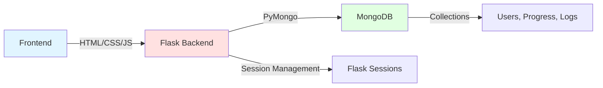
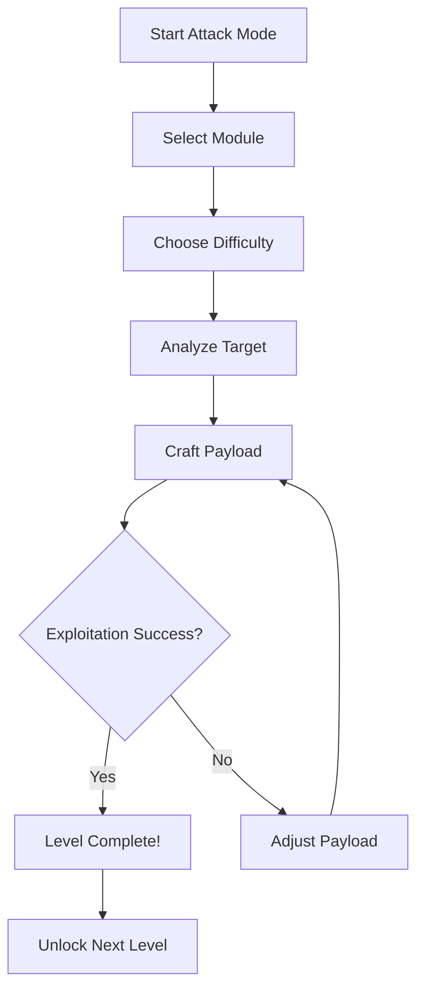
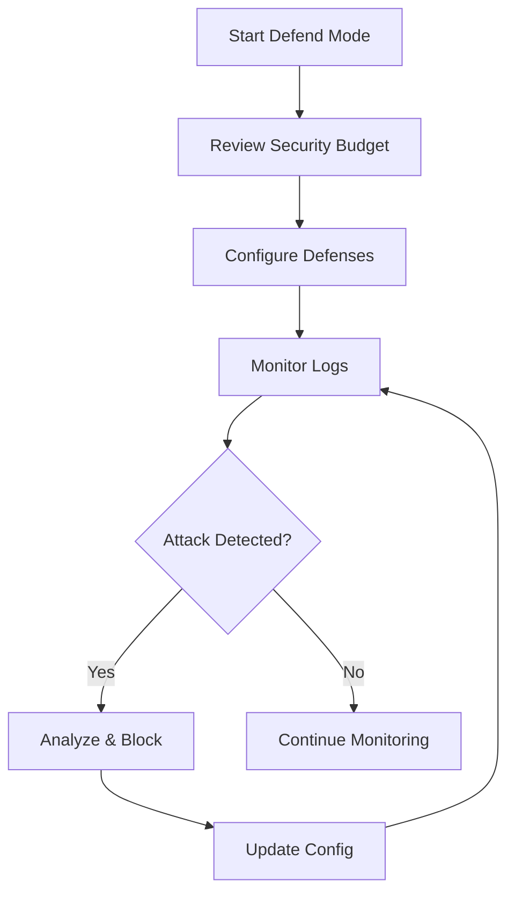

# 🔐 VulnLab - Interactive Cybersecurity Training Platform

<div align="center">


[](https://www.python.org/)
[](https://flask.palletsprojects.com/)
[](https://www.mongodb.com/)
[](LICENSE)

**An Intentionally Vulnerable Web Application for Ethical Hacking & Cybersecurity Education**

[Features](#-features) • [Installation](#-installation) • [Architecture](#-architecture) • [Usage](#-usage) • [Team](#-team) • [Security](#-security-notice)

</div>

---

## ⚠️ **CRITICAL SECURITY NOTICE**

```diff
! WARNING: INTENTIONALLY VULNERABLE APPLICATION
! ═══════════════════════════════════════════════════════════
! This application contains REAL security vulnerabilities
! designed for educational purposes ONLY.
! 
! ❌ DO NOT deploy to production environments
! ❌ DO NOT expose to public internet
! ❌ LOCALHOST USE ONLY
! ✅ Educational training and ethical hacking practice ONLY
```

---

## 🎯 **Overview**

VulnLab is a cutting-edge cybersecurity training platform that provides hands-on experience with real-world vulnerabilities in a safe, controlled environment. Built with Flask and MongoDB, it offers dual-mode gameplay where users can both exploit vulnerabilities as attackers and defend against them as security professionals.

### **Key Highlights**

- 🎮 **Dual-Mode Gameplay**: Switch between Attack and Defend modes
- 🎓 **Progressive Learning**: Four difficulty levels from Easy to Impossible
- 🔍 **Real Vulnerabilities**: NoSQL Injection, XSS, and more
- 📊 **Live Feedback**: Real-time attack/defense metrics and logs
- 🏆 **Gamification**: Streaks, progress tracking, and achievements
- 🛡️ **Realistic Defenses**: Implement actual security controls with budget constraints

---

## ✨ **Features**

### 🔴 **Attack Mode (Red Team)**

<table>
<tr>
<td width="50%">

#### **Offensive Capabilities**
- **NoSQL Injection Exploitation**
  - JSON payload manipulation
  - MongoDB operator abuse
  - Authentication bypass techniques
  
- **Cross-Site Scripting (XSS)**
  - Stored XSS attacks
  - Event handler injection
  - Advanced bypass techniques

</td>
<td width="50%">

#### **Attack Mechanics**
- 📡 Reconnaissance tools
- 🎯 Multi-step attack chains
- 🥷 Stealth rating system
- 📈 Noise level tracking
- 🔗 Attack chain progression

</td>
</tr>
</table>

### 🛡️ **Defend Mode (Blue Team)**

<table>
<tr>
<td width="50%">

#### **Defense Mechanisms**
- **Input Validation**
  - Blacklist filtering
  - Whitelist validation
  - Parameterized queries
  
- **Authentication Security**
  - Account lockout
  - CAPTCHA integration
  - Multi-factor authentication

</td>
<td width="50%">

#### **Security Controls**
- 💰 Budget-based security deployment
- 📊 Real-time risk assessment
- 🚨 Attack detection logs
- 🔒 CSRF protection
- 🛡️ Security headers (CSP, HSTS)

</td>
</tr>
</table>

---

## 🏗️ **Architecture**

### **Technology Stack**



### **System Components**

| Component | Technology | Purpose |
|-----------|-----------|---------|
| **Backend** | Flask 2.0+ | Web framework & routing |
| **Database** | MongoDB | User data & progress tracking |
| **Frontend** | Jinja2 Templates | Dynamic page rendering |
| **Security** | Custom Middleware | Vulnerability simulation |
| **Analytics** | Session Storage | Real-time metrics |

### **Database Schema**

```
Collections:
├── users                    # User accounts (⚠️ plain text passwords)
├── progress                 # Level completion & streaks
├── attempts                 # Attack attempt logs
├── comments                 # XSS payload storage
├── defender_attempts        # Defense logs
├── defense_logs             # Security event logs
└── security_config          # Defense configurations
```

---

## 🚀 **Installation**

### **Prerequisites**

- Python 3.8 or higher
- MongoDB 4.4 or higher
- pip (Python package manager)
- Git

### **Quick Start**

```bash
# 1. Clone the repository
git clone https://github.com/yourusername/vulnlab.git
cd vulnlab

# 2. Create virtual environment
python -m venv venv

# 3. Activate virtual environment
# On Windows:
venv\Scripts\activate
# On macOS/Linux:
source venv/bin/activate

# 4. Install dependencies
pip install flask pymongo

# 5. Start MongoDB
# Make sure MongoDB is running on localhost:27017
mongod --dbpath /path/to/data/directory

# 6. Run the application
python app.py

# 7. Access the application
# Open browser to: http://localhost:5000
```

### **Environment Variables** (Optional)

```bash
export MONGODB_URI="mongodb://localhost:27017/"
export FLASK_ENV="development"
```

---

## 📖 **Usage Guide**

### **1. Registration & Setup**

```
1. Navigate to http://localhost:5000
2. Click "Register" and create an account
3. Login with your credentials
4. Select your initial mode (Attack/Defend)
```

### **2. Attack Mode Workflow**



### **3. Defend Mode Workflow**



### **Sample Payloads**

#### **NoSQL Injection (Easy)**
```json
Username: {"$ne": null}
Password: {"$ne": null}
```

#### **XSS (Medium)**
```html

```

#### **XSS (Hard)**
```html
<svg onload="alert(document.cookie)">
```

---

## 🎮 **Difficulty Levels**

| Level | Description | Security Controls | Exploit Complexity |
|-------|-------------|-------------------|-------------------|
| 🟢 **Easy** | No protections | None | Basic payloads work |
| 🟡 **Medium** | Basic filtering | Minimal validation | Requires bypass techniques |
| 🟠 **Hard** | Advanced filtering | Partial sanitization | Sophisticated payloads needed |
| 🔴 **Impossible** | Full protection | Complete sanitization | Secure implementation |

---

## 📊 **Metrics & Tracking**

### **Attack Metrics**
- 🎯 Noise Level (0-100): Stealthiness indicator
- 🚨 Risk Score: Exposure measurement
- 📈 Stealth Rating: Attack sophistication
- 🔗 Attack Chain Progress

### **Defense Metrics**
- 💰 Security Budget Usage
- 📉 Current Risk Level
- 🛡️ Exposure Score
- 📊 False Positive Rate
- ⏱️ Detection Latency

---

## 🔒 **Security Notice**

### **Known Vulnerabilities (Intentional)**

```
✗ NoSQL Injection via JSON parsing
✗ Cross-Site Scripting (XSS) - Stored & Reflected
✗ Weak session management
✗ Plain text password storage
✗ Missing input validation
✗ No CSRF protection (low security)
✗ Insecure direct object references
✗ Information disclosure
```

### **Defense Mechanisms Available**

```
✓ Input sanitization (configurable)
✓ MongoDB operator filtering
✓ HTML entity encoding
✓ CSRF token validation
✓ Security headers (CSP, HSTS)
✓ Rate limiting
✓ Account lockout
✓ Multi-factor authentication
```

---

## 👥 **Team**

<div align="center">

### **VulnLab Development Team**

<table>
<tr>
<td align="center">
<br />
<sub><b>Roshini B</b></sub><br />
</td>
<td align="center">
<br />
<sub><b>Poorvaa Sri B</b></sub><br />
</td>
<td align="center">
<br />
<sub><b>Srivarshini K</b></sub><br />
</td>
</tr>
</table>

</div>

---

## 🛠️ **Project Structure**

```
vulnlab/
│
├── app.py                      # Main Flask application
├── requirements.txt            # Python dependencies
├── README.md                   # This file
│
├── templates/                  # HTML templates
│   ├── index.html             # Landing page
│   ├── login.html             # Login page
│   ├── register.html          # Registration
│   ├── dashboard.html         # User dashboard
│   ├── attack_mode.html       # Attack interface
│   ├── defender_mode.html     # Defense interface
│   ├── nosql_level.html       # NoSQL challenge
│   ├── xss_level.html         # XSS challenge
│   └── defense_logs.html      # Security logs
│
└── static/                     # Static assets (CSS, JS, images)
    ├── css/
    ├── js/
    └── images/
```

---

## 📚 **Learning Objectives**

By completing VulnLab challenges, users will learn:

- ✅ How NoSQL injection attacks work and how to prevent them
- ✅ Various XSS attack vectors and mitigation strategies
- ✅ Importance of input validation and output encoding
- ✅ Defense-in-depth security principles
- ✅ Budget-based security decision making
- ✅ Attack chain methodology
- ✅ Real-world vulnerability exploitation
- ✅ Blue team defensive strategies

---

## 🤝 **Contributing**

We welcome contributions! Please follow these guidelines:

1. Fork the repository
2. Create a feature branch (`git checkout -b feature/AmazingFeature`)
3. Commit your changes (`git commit -m 'Add some AmazingFeature'`)
4. Push to the branch (`git push origin feature/AmazingFeature`)
5. Open a Pull Request

---

## 📝 **License**

This project is licensed for **Educational Use Only**. 

```
Copyright (c) 2025 VulnLab Team
Educational purposes only - Not for production use
```

---

## 🔗 **Resources**

- [OWASP Top 10](https://owasp.org/www-project-top-ten/)
- [MongoDB Security Checklist](https://docs.mongodb.com/manual/administration/security-checklist/)
- [XSS Prevention Cheat Sheet](https://cheatsheetseries.owasp.org/cheatsheets/Cross_Site_Scripting_Prevention_Cheat_Sheet.html)
- [Flask Security](https://flask.palletsprojects.com/en/2.0.x/security/)

---
## 📧 **Contact**

For questions, suggestions, or issues:

- 🐛 **Report a Bug:** https://github.com/srivarshini-karthikeyan/vulnlab/issues  
- 💡 **Request a Feature:** https://github.com/srivarshini-karthikeyan/vulnlab/issues  
- 📧 **Email:**  
  - roshinibk1912@gmail.com  
  - poorvaabaskar@gmail.com  
  - srivarshinikarthikeyanoffl@gmail.com  

---

<div align="center">

### ⭐ Star this repository if you found it helpful!

**Made with ❤️ by Roshini B, Poorvaa Sri B & Srivarshini K**


</div>

---

## 🎓 **Disclaimer**

> This application is designed exclusively for educational purposes. The vulnerabilities implemented are intentional and should never be replicated in production environments. Users are responsible for ensuring they use this tool ethically and legally. The creators assume no liability for misuse of this software.
